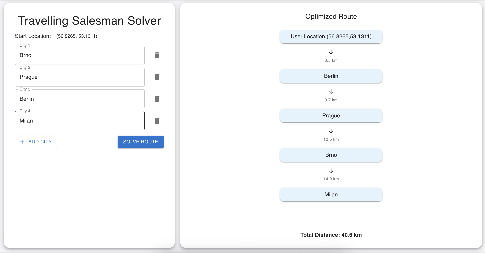

# 🧭 Travelling Salesman Problem – Full Stack Demo App

This project is a minimal full-stack web application. It is designed to demonstrate the architecture and approach to solving the **Travelling Salesman Problem (TSP)** using a mock distance matrix.

The application takes a list of cities as input and returns them ordered based on estimated distances. The distance values are mocked (randomly generated) — no real-world APIs or maps are used.

---

## ⚙️ Tech Stack

- **Frontend:** React + Vite
- **Backend:** Python + Flask
- **Containerization:** Docker & Docker Compose
- **Proxy:** Nginx (for frontend-to-backend communication)
- **Extras:** Pytest and Jest for tests


---
## 📸 Screenshot


## 📁 Project Structure

```
.
├── backend
│   ├── app
│   ├── Dockerfile
│   ├── env
│   ├── requirements.txt
│   ├── server.py
│   └── tests
├── docker-compose.yaml
├── frontend
│   ├── Dockerfile
│   ├── eslint.config.js
│   ├── index.html
│   ├── jest.config.ts
│   ├── node_modules
│   ├── package-lock.json
│   ├── package.json
│   ├── public
│   ├── README.md
│   ├── src
│   ├── tsconfig.app.json
│   ├── tsconfig.json
│   ├── tsconfig.node.json
│   └── vite.config.ts
├── nginx
│   └── nginx.conf
└── README.md
```
---
## ⚙️ Prerequisites
- [Docker](https://docs.docker.com/get-docker/)
- [Docker Compose](https://docs.docker.com/compose/)
## 🚀 How to Run the App

1. **Clone the repository**:

```
git clone git@github.com:Tricked111/Travelling-Salesman-Problem.git
cd Travelling-Salesman-Problem
```
2. **Start the services:**
```
docker-compose up --build
```
3. **Visit in your browser:**
```
http://localhost
```
## 🌐 Network and Port Configuration

| Service  | Port (Internal) | Public Access             |
|----------|-----------------|---------------------------|
| Frontend | 4173            | ✅ via Nginx (port 80)    |
| Backend  | 8888            | ❌ internal network only  |
| Nginx    | 80              | ✅ publicly accessible    |

